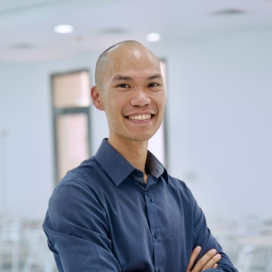

  

    <!-- <h1 style="margin-bottom:0.25rem;">Dinh-Son Vu</h1> -->
    

        Lecturer 
        Robotics and Mechatronics Program 
        School of Science, Engineering, and Technology 
        RMIT Vietnam, Ho Chi Minh City 
        Email: <a href="mailto:dinh-son.vu@rmit.edu.vn">dinh-son.vu@rmit.edu.vn</a> 
        <a href="https://github.com/vudinhso">GitHub</a> · 
        <a href="https://www.linkedin.com/in/dinh-son-vu/">LinkedIn</a> · 
        <a href="https://scholar.google.com/citations?user=fKtqrDkAAAAJ&hl=en&oi=ao">Scholar</a> · 
        <a href="https://orcid.org/0000-0002-0567-6419">Orcid</a> · 
    

  

  

    
  

---
## Summary

Dinh-Son is a robotic enthusiast that enjoys designing, controlling, and working with serial arm robot (JACO), parallel robots, cable-driven mechanisms, and exoskeletons, with a focus on physical human-robot interaction (pHRI). 
He holds three engineering degrees (engineering, master, and PhD) from three different countries (France, United Kingdom, and Canada). He is passionate about foreign cultures and social interaction with people and their different mindsets. 
His postdoctoral fellowship focused on the design and control of exoskeletons for home use, performed in Aalborg University, Denmark. 
Dinh-Son has taught three years as an Assistant Professor in AUM, Kuwait in Mechatronics and he is continuing his career in RMIT, Vietnam as a Lecturer in Robotics and Mechatronics department.

---

## Education

**Doctor of Philosophy (PhD), Robotics — Laval University, Canada · 2017**  
- Design and Control of a Locomotion Interface for Gait Rehabilitation  
- Thesis obtained with summa cum laude  

**Master of Science (MSc), Aeronautics — Cranfield University, United Kingdom · 2010**  
<!-- - Autonomous Vehicle Dynamics and Control   -->
- Autonomous Vehicle waypoint navigation and obstacle avoidance guidance

**Engineering Degree, Mechatronics — University of Technology of Compiegne, France · 2010**  
- Mechanical Engineering Program
- Speciality MARS: Mechatronics, Actuators, Robotisation, and Systems

---
## Experience

**Lecturer** | **2022 – Present** | **RMIT Vietnam**

Drive engineering design coursework utilizing ROS2 and facilitate practical, industry-standard programming with collaborative ABB GoFa robots.
Embedded systems and control theory, physical implementation of PID controllers for encoder-equipped DC motors. Course: Engineering Mechanics, Control Systems, Engineering Design. Skill: MATLAB, ROS2, VSCode, Ubuntu

**Assistant Professor** | **2019 – 2022** | **American University of the Middle East (AUM), Kuwait**

Preparation and moderation for several courses including Mechatronics, Dynamics, Statics, and Measurement Systems. Laboratory improvement for the Mechatronics course: PLC, 3-DOFs robot, microcontroller, and basic electronics implementation. Workshop organization: initiation to machine learning, and to robotic kinematics based on screw theory. 

- Course: Mechatronics
- Skill: MATLAB, ROS2, VSCode, Ubuntu

**Post-doctoral Fellow** | **2017 – 2019** | **Aalborg University, Denmark**

<a href="https://www.exo-aider.dk/">Project Exo-Aider</a> Project Exo-Aider, Denmark: Development of assistive exoskeletons for wheelchair users and elderly people. Intuitive human robot interaction with collaboration with therapist for
the control of a robotic arm mounted on a wheelchair. Mechatronic team manager: deliverable preparation, tasks assignment, and product development based on an Agile management. Teaching assistant of industrial robotic projects with Problem-based Learning (PBL). 

**PhD Candidate** | **2012 – 2017** | **Laval University, Canada**

Design and manufacturing of the locomotion interface, simulation of a virtual environment, stability analysis of the mechanism. Haptic and physical human-robot interaction: force and position control of the interface in the virtual environment. JACO Robotic Arm user: design of an intuitive control to facilitate the use of the device. 

**Automotive Engineer** | **2010 – 2012** | **Delphi, France**

Simulink expert: design of the ECU control strategy relative to the customer’s specification. Validation of the ECU with unit testing and on car prototypes. Respect of the 5S workplace organization method

---

## Grants

**NAWA PROM 2026** | **$2700**  

<a href="https://krim.agh.edu.pl/en/">AGH Krakow, Department of Robotics and Mechatronics</a>  
Adoption of ROS 2 in classroom: from prototyping to fleet of autonomous ground robots

**Industry Seed Fund 2025** | **$50000**  

Byron Anthony Mason, Minh Quang Tran, with the company 
<a href="https://esg.orlar.com/">Orlar</a>  
Plant Stress Monitoring and Mitigation for Sustainable Indoor Agriculture in Vietnam  

**Vietnam Research Grant 2025** | **$7600**  

Byron Anthony Mason, Minh Quang Tran  
Engineering a Sustainable Mobility Solution through AI-Optimized Electric Vehicle Integration and Big Data Analytics for Reduced Air Pollution in Vietnam

**Vietnam Research Grant 2025** | **$7600**  

Hung Pham Viet  
Integrating Language Processing for Waste Sorting Robot Control

**Scholarship of Teaching and Learning 2025** | **$3000**  

Thu Hyunh, Jeff Nijsse, Katrina Phillips  
Gendered Task Division in Group Work

---

## Projects

**Capstone Project 2026**   
Jereon Roomer, with the company 
<a href="https://thefruitrepublic.com/">The Fruit Republic</a> and
<a href="https://hyves.tech/">Hyves Tech</a>  
Smart Field Robot for Lime Farming in Bến Lức (Long An).  
Weed, Pest and Spray Decision Support in Canal-Based Orchards: Design of the Digital Twin  

**Capstone Project 2025**   
Lyndal Hugo, Leo Monnier, with the company 
<a href="https://esg.orlar.com/">Orlar</a>  
Automated Wedges Collection and Plant Disease Detection System 

**Capstone Project 2024**   
Building a Drone from the ground up 

**Capstone Project 2023**   
Truong Dinh Thai, with the company 
<a href="https://www.abb.com/">ABB</a>  
Pick and Place Application with ABB IRB 920T robot

**Highschool Robotic Workshops 2022 – 2026**   
Design and control of Robotic Swarm

---

## Certification

SOLIDWORKS Additive Manufacturing Associate | 2025

Coursera | University of Alberta | Fundamentals of Reinforcement Learning | 2020

Coursera | deeplearning.ai | Deep Learning | 2020

## Research

T. Trang, H. V. Pham, S. Dinh-Son Vu, T. M. Le, H. M. Tran and S. V. T. Dao, "TrashVLM: Lightweight and Efficiently Fine-Tuned Vision-Language Models for Waste Classification," 2025 International Conference on Advanced Technologies for Communications (ATC), Hanoi, Vietnam, 2025, pp. 1-7, doi: 10.1109/ATC67618.2025.11268574.

Dinh-Son Vu, M. -T. Vo, A. N. Le Quoc, K. H. Nguyen and T. Q. Tran, "On the Design and Performance of Delta Robot Platform with Compliant Revolute Joint," 2024 13th International Conference on Control, Automation and Information Sciences (ICCAIS), Ho Chi Minh City, Vietnam, 2024, pp. 1-6, doi: 10.1109/ICCAIS63750.2024.10814546. 

Campeau-Lecours, A., Dinh-Son Vu, Schweitzer, F., and Roy, J. (April 8, 2020). "Alternative Representation of the Shoulder Orientation Based on the Tilt-and-Torsion Angles." ASME. J Biomech Eng. July 2020; 142(7): 074504

Dinh-Son Vu, Barnett, E., and Gosselin, C. (February 27, 2019). "Experimental Validation of a Three-Degree-of-Freedom Cable-Suspended Parallel Robot for Spatial Translation With Constant Orientation." ASME. J. Mechanisms Robotics. April 2019; 11(2): 024502.

A. Campeau-Lecours, U. Côté-Allard, Dinh-Son Vu, F. Routhier, B. Gosselin and C. Gosselin, "Intuitive Adaptive Orientation Control for Enhanced Human–Robot Interaction," in IEEE Transactions on Robotics, vol. 35, no. 2, pp. 509-520, April 2019, doi: 10.1109/TRO.2018.2885464.

Dinh-Son Vu, U. C. Allard, C. Gosselin, F. Routhier, B. Gosselin and A. Campeau-Lecours, "Intuitive adaptive orientation control of assistive robots for people living with upper limb disabilities," 2017 International Conference on Rehabilitation Robotics (ICORR), London, UK, 2017, pp. 795-800, doi: 10.1109/ICORR.2017.8009345. 

Dinh-Son Vu, Barnett, E., Zaccarin, AM., Gosselin, C. (2018). On the Design of a Three-DOF Cable-Suspended Parallel Robot Based on a Parallelogram Arrangement of the Cables. In: Gosselin, C., Cardou, P., Bruckmann, T., Pott, A. (eds) Cable-Driven Parallel Robots. Mechanisms and Machine Science, vol 53. Springer, Cham. doi: 10.1007/978-3-319-61431-1_27

Dinh-Son Vu, J. Kövecses and C. Gosselin, "Trajectory planning and control of a belt-driven locomotion interface for flat terrain walking and stair climbing," 2017 IEEE World Haptics Conference (WHC), Munich, Germany, 2017, pp. 189-194, doi: 10.1109/WHC.2017.7989899

Dinh-Son Vu, S. Foucault, C. Gosselin and J. Kövecses, "Design of a locomotion interface for gait simulation based on belt-driven parallel mechanisms," 2015 IEEE International Conference on Robotics and Automation (ICRA), Seattle, WA, USA, 2015, pp. 1581-1586, doi: 10.1109/ICRA.2015.7139399

<!-- 
---

## Skills

| Area | Technologies |
|------|-------------|
| Languages | Go, Python, TypeScript, SQL |
| Infrastructure | Kubernetes, Docker, AWS, Terraform |
| Databases | PostgreSQL, Redis, MongoDB |
| Practices | System design, API design, Code review |

---

## Documentation

- [Project Alpha — technical notes](docs/project-alpha)
- [API reference](docs/api-reference)
- [Setup guide](docs/setup) -->
